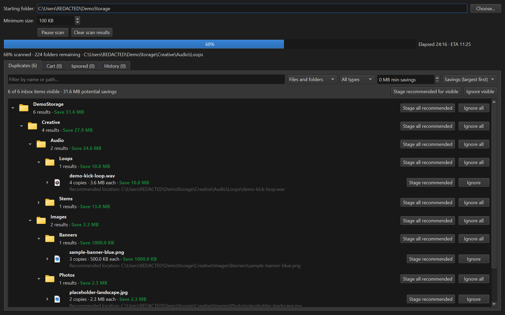

# DupeFinder

DupeFinder is a Windows desktop app for finding byte-for-byte duplicate files and
staging safe cleanup decisions before changing anything on disk.



## What it does

- Recursively scans a folder chosen in the app.
- Ignores files below a configurable minimum size (100 KB by default).
- Finds duplicates efficiently by grouping by file size, comparing a short
  BLAKE2b hash, and calculating a full BLAKE2b hash only for likely matches.
- Remembers completed folders in SQLite. A later scan checks unvisited folders
  first; after every folder has been covered, the next scan starts a fresh cycle.
- Starts hashing while folder discovery is still running, then transitions from
  indeterminate progress to percentage and remaining-folder progress.
- Builds review snapshots and image thumbnails off the GUI thread, coalescing
  live scan updates so the window remains movable and resizable during scans.
- Shows compact, collapsed duplicate groups while the background scan is still
  running. One shared thumbnail represents the identical content.
- Organizes results into collapsed nested folder groups using the deepest
  directory shared by each duplicate set's copy locations.
- Keeps expanded folder/result nodes stable while live scan snapshots arrive,
  preserving the browsing position instead of collapsing the tree.
- Provides folder-node actions to stage every descendant's safe recommendation
  or ignore all duplicate results under that node.
- Highlights differing path components, suppresses identical timestamp noise,
  and provides subtle hover actions to open a file or reveal it in Explorer.
- Rolls proven identical or subset folder trees into one destination-folder
  decision while retaining per-file hash validation.
- Treats Duplicates as an inbox. Decisions move to a persistent Cart, while
  intentionally skipped groups move to an Ignored tab.
- Filters and sorts by path, type, item kind, copy count, and potential savings;
  visible results can be staged or ignored in bulk.
- Always preserves the oldest copy's bytes and timestamps. Selecting a newer
  copy means "keep this location," so the oldest file is moved to that path.
- Sends removed copies to the Windows Recycle Bin.
- Records commits in History and can reconstruct removed exact duplicates at
  their original paths and timestamps when Undo preflight checks remain safe.
- Shows continuously updated elapsed scan time and a smoothed ETA once the scan
  scope and processing rate are known.

## Run from source

```powershell
cd C:\Users\mikem\Repos\DupeFinder
python -m venv .venv
.\.venv\Scripts\python.exe -m pip install -r requirements.txt
.\.venv\Scripts\python.exe main.py
```

Application state is stored in `%LOCALAPPDATA%\DupeFinder`, including the SQLite
database and generated thumbnail cache.

## Build the standalone executable

```powershell
.\build.ps1
```

The executable is written to `dist\DupeFinder.exe`.

## Safety model

Before a staged action runs, every file is checked again for existence, size,
and full content hash. If any file changed, that action is left in the cart with
an error instead of deleting anything. Actions are processed independently, so
one failed group does not stop the remaining groups.

Ignored groups return to the inbox if their copy membership changes. Staged
groups whose membership changes are marked stale and cannot be committed until
they are reviewed again.

**Clear scan results** removes the selected root's current Duplicates cache,
folder progress, and Cart while preserving Ignored decisions and History. The
Ignored tab has a separate **Clear ignored** action.

Undo recreates files from the retained exact duplicate. It is intentionally
blocked if the retained file changed or an original destination path has become
occupied. Recycle Bin entries are not modified by Undo.
